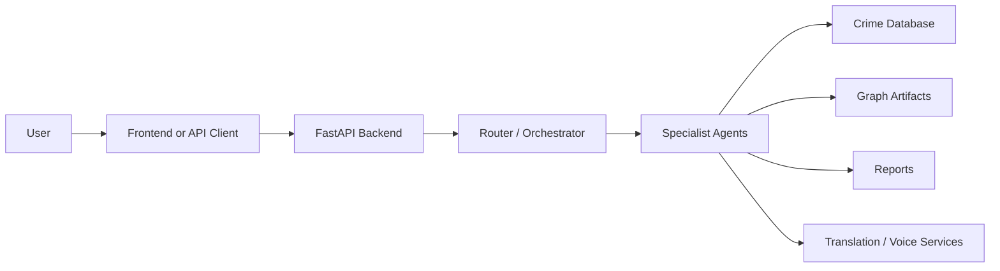
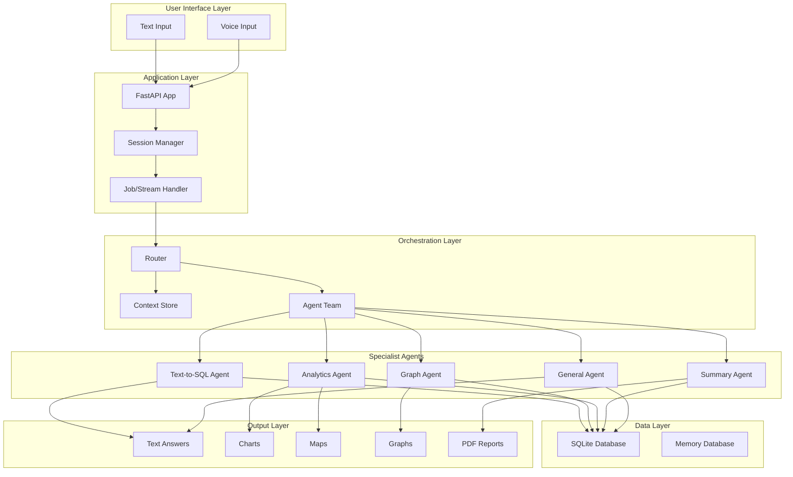
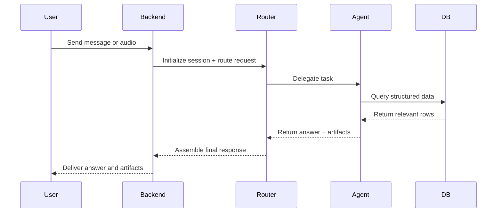
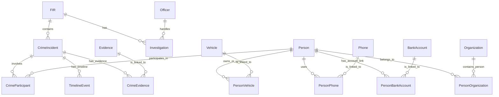

# Cluvo: The One-Stop Knowledge Guide

## 1. What Cluvo Is

Cluvo is a conversational intelligence system for crime investigation and case understanding. It is designed to let a user ask plain-language questions about a synthetic crime database and receive structured answers, visual artifacts, and reports instead of manually querying tables or writing SQL.

In simple terms, Cluvo behaves like a digital investigation assistant that can:

- understand natural-language questions,
- decide which specialist skill is needed,
- query a crime database safely,
- build relationship maps around people,
- generate analytics and charts,
- create PDF case summaries,
- and respond in a conversational way.

It is not just a chatbot. It is a multi-agent reasoning system with a structured backend, a crime database, and artifact generation pipelines.

---

## 2. The Big Picture

Think of Cluvo as three layers working together:

1. User interaction layer
   - The user asks a question in text or voice.
   - The system captures the request and sends it to the backend.

2. Intelligence layer
   - Specialized agents interpret the request.
   - They decide whether the task is about SQL lookup, graph building, analytics, or summarization.

3. Data and artifact layer
   - The system reads from a crime database.
   - It can generate graphs, charts, maps, and reports as outputs.

### High-level system view

---

## 3. What Cluvo Is Built To Do

Cluvo is aimed at answering investigation-oriented questions such as:

- Who are the accused in a particular FIR?
- Which district has the most crime incidents?
- What are the monthly crime trends?
- What are the common crime types in the dataset?
- What is the network around a specific person?
- Can you generate a summary report for a case?

The platform is especially useful when users need insights from structured data without manually understanding the schema.

### Common use cases

- Case lookup
- Person/entity investigation
- Relationship mapping
- Crime trend analysis
- Spotlighting hotspots
- Creating narrative case reports

---

## 4. The Core Architecture

Cluvo uses a modular architecture. The major components are:

- Frontend/API client
- FastAPI backend
- Investigation orchestrator
- Specialist agents
- Crime database
- Artifact generation service
- Translation and speech layer

### Architecture overview

---

## 5. How a Request Flows Through Cluvo

When a user sends a prompt, the system follows a sequence of steps.

### Step 1: Request enters the app
A request is received either as text or as voice audio. The API layer validates the payload and creates or reuses a session.

### Step 2: Session context is prepared
Cluvo keeps track of information about the current conversation, including the session ID, user language, and earlier findings. This allows it to maintain continuity across turns.

### Step 3: The request is routed
A coordinator-style team of agents receives the input. The router decides which specialist agent or combination of agents is most appropriate.

### Step 4: Tools and data are used
The selected agent may:

- run a SQL query,
- inspect the database,
- build a relationship graph,
- calculate analytics,
- or gather context for a case summary.

### Step 5: The response is assembled
The result may be a plain-language answer, a chart, a map, a graph artifact, or a PDF report. The backend packages this into a response for the client.

### Request lifecycle diagram

---

## 6. The Specialist Agents

Cluvo is organized around a small team of agents. Each has a specific responsibility.

### 6.1 General Agent
The general agent is the conversational fallback. It handles broad questions, greetings, ambiguity, and general conversation.

It is useful when the user asks:

- “Hi”
- “Can you help me?”
- “What can you do?”
- “I am not sure what I need”

### 6.2 Text-to-SQL Agent
This agent translates natural-language questions into SQL queries against the crime database.

It is used when the user asks for factual details such as:

- cases,
- FIR numbers,
- persons,
- officers,
- evidence,
- vehicles,
- accounts,
- or transactions.

This agent relies on:

- a table catalog,
- schema descriptions,
- and safe SQL execution rules.

### 6.3 Graph Agent
This agent builds person-centered relationship networks. It connects a person to:

- incidents,
- co-accused persons,
- organizations,
- vehicles,
- phones,
- bank accounts,
- and related financial transactions.

Its outputs are interactive HTML network graphs stored as artifact files.

### 6.4 Analytics Agent
This agent performs higher-level analysis over the dataset. It is responsible for:

- crime counts by district,
- monthly trends,
- crime type breakdowns,
- crime category breakdowns,
- hotspot analysis,
- and repeat-offender rankings.

It can return both spoken insights and machine-readable chart/map structures.

### 6.5 Summary Agent
This agent creates structured case summaries for a selected FIR. It gathers context from multiple related tables and packages it into a narrative-style report.

It can also generate a PDF document that summarizes:

- FIR overview,
- incidents,
- participants,
- investigations,
- timeline events,
- and evidence.

---

## 7. The Data Model

Cluvo’s knowledge lives in a relational SQLite database. The database is designed around crime investigation entities rather than generic business objects.

### Key entities

- Case
- FIR
- CrimeIncident
- Person
- Officer
- Location
- PoliceStation
- CrimeType
- ModusOperandi
- Evidence
- Vehicle
- Phone
- BankAccount
- Organization
- FinancialTransaction
- TimelineEvent
- CrimeParticipant

### Why the schema matters
The schema is intentionally structured so that the assistant can answer questions across multiple dimensions:

- who was involved,
- where did it happen,
- what crime type was involved,
- which officer handled it,
- what evidence exists,
- and which financial or communications links exist.

### Relationship model in plain language

---

## 8. How Cluvo Stores Conversation State

Cluvo maintains session-level state so that conversations feel continuous. Rather than treating each ask as isolated, it remembers:

- user identity,
- session identity,
- detected language,
- selected person IDs,
- FIR context,
- graph artifacts,
- analytics results,
- and summary report locations.

This is important because a user may ask a question in one turn and then ask a follow-up that depends on the earlier answer.

### Example
A user may first ask:

- “Build a network around Ravi Kumar”

Then later ask:

- “Show me the incidents linked to that person”

The system can use earlier context to keep the conversation coherent.

---

## 9. Voice and Language Support

Cluvo is not limited to typed text. It includes a voice pathway that can process spoken audio and optionally return audio responses.

### What happens with voice input
1. Audio is received.
2. Speech-to-text converts it into text.
3. The text is routed through the same reasoning pipeline.
4. The answer can be delivered as text and, in some flows, as audio.

This makes the system usable in hands-free or field-oriented scenarios.

---

## 10. Artifacts That Cluvo Produces

One of the strongest features of Cluvo is that it does more than answer questions verbally. It creates artifacts.

### 10.1 Graph artifacts
Generated as HTML files, useful for exploring relationships between people, incidents, vehicles, phones, accounts, and organizations.

### 10.2 Charts
The analytics agent can structure chart-ready data for visual representation.

### 10.3 Maps
Hotspot analysis can be converted into map-ready point data.

### 10.4 PDF reports
A summary agent can create a structured report for a specific FIR and save it as a PDF file.

---

## 11. How the Backend Is Organized

The backend is organized into a few important modules:

- main entrypoint: handles API routes and streaming jobs
- config: sets paths, ports, and environment handling
- database layer: manages SQLite connections and schema initialization
- orchestrator: coordinates the agent team and session state
- agents: contain the implementation of each specialist role
- services: include translation and speech integrations

This separation makes the system easier to extend. For example, adding a new kind of agent becomes a matter of introducing a new agent module and connecting it into the orchestrator.

---

## 12. How to Run Cluvo Locally

The project is intended to run as a backend service, with a frontend or API client sending requests to it.

### Prerequisites
- Python environment
- required packages from the project requirements
- a configured LLM provider
- a valid secret or environment setup for speech services if voice is being used

### Typical workflow
1. Install dependencies.
2. Initialize the SQLite database.
3. Seed synthetic data.
4. Start the backend service.
5. Send requests through the chat endpoints.

### Important note
The system expects a proper environment configuration. If secrets or service credentials are missing, some features may fail.

---

## 13. Example Questions a User Can Ask

Here are examples that show the kind of work Cluvo is designed for:

- “Who are the accused in FIR KSP/2023/0042?”
- “Build a network around Ravi Kumar.”
- “Which district has the highest crime count?”
- “Show monthly crime trends.”
- “Show crime hotspots in Karnataka.”
- “Generate a case report for FIR KSP/2023/0042.”
- “What are the most common crime types?”
- “Who are the repeat offenders?”

These questions map to different internal capabilities:

- factual lookup → SQL agent
- network building → graph agent
- trend analysis → analytics agent
- report generation → summary agent

---

## 14. What Cluvo Is Good At

Cluvo is strongest when the user needs a fast bridge between natural language and structured investigation data.

It is particularly good at:

- turning plain questions into actionable database queries,
- connecting entities across multiple tables,
- exploring social or investigative networks,
- summarizing incident context,
- and producing artifacts useful for human analysts.

---

## 15. What Cluvo Is Not

Cluvo is not a fully autonomous investigative platform in the sense of replacing human analysts. It is a prototype assistant that helps with structured exploration and summarization.

It is not intended to:

- provide legal conclusions,
- replace human judgment,
- guarantee perfect reasoning in every case,
- or serve as a production-grade police intelligence system without further hardening.

---

## 16. Practical Mental Model

If you are new to Cluvo, use this mental model:

- The user asks a question.
- The system interprets the intent.
- The relevant specialist agent gathers evidence from the database.
- The answer is returned in a human-friendly form.
- If needed, the system also creates a graph, chart, map, or PDF.

In other words, Cluvo is less like a simple FAQ bot and more like a team of specialists working together around one investigation dataset.

---

## 17. Design Philosophy

Cluvo was designed around a few principles:

- make investigation data accessible through language,
- keep the system modular,
- separate reasoning from storage,
- support both text and voice input,
- and turn answers into useful artifacts.

That design makes it suitable for rapid prototyping, demos, and exploration.

---

## 18. Troubleshooting Mental Notes

If something seems off, common areas to inspect are:

- environment configuration,
- missing secrets or credentials,
- database initialization status,
- session state issues,
- and whether the correct agent was chosen for the task.

A good rule is: if the user is asking for facts, the SQL pathway is likely involved; if the user is asking for relationships, the graph pathway is likely involved; if the user is asking for trends, the analytics pathway is likely involved.

---

## 19. Summary

Cluvo is a conversational crime intelligence assistant built around a multi-agent architecture. It combines natural-language understanding, structured database access, graph generation, analytics, summaries, and artifact creation to help someone explore crime data without needing to directly write queries or inspect raw tables.

If you understand the following five things, you understand the essence of Cluvo:

1. It is a conversational assistant for crime investigation data.
2. It uses multiple specialist agents rather than a single monolithic model.
3. It works over a structured relational database.
4. It can create graphs, charts, maps, and reports.
5. It is designed to support investigation workflows, not just chat.

---

## 20. Quick Glossary

- Agent: a specialist module with a focused job.
- Session: a conversation context that carries state across turns.
- FIR: a first information report or case record.
- Artifact: a generated file such as a graph or report.
- Orchestrator: the component that coordinates multiple agents.
- SQL agent: the module that turns language into database queries.
- Graph agent: the module that builds relationship maps.
- Analytics agent: the module that calculates trends and breakdowns.
- Summary agent: the module that produces narrative case reports.

---

## 21. Final Takeaway

If you are seeing Cluvo for the first time, the best way to think about it is this:

Cluvo is an investigation copilot that helps a user ask questions in natural language and receive structured, evidence-backed answers from a crime database, along with useful visual and written outputs.
